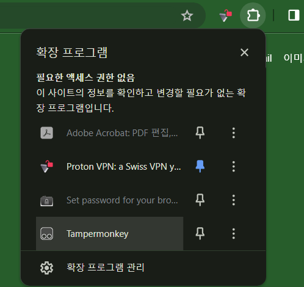
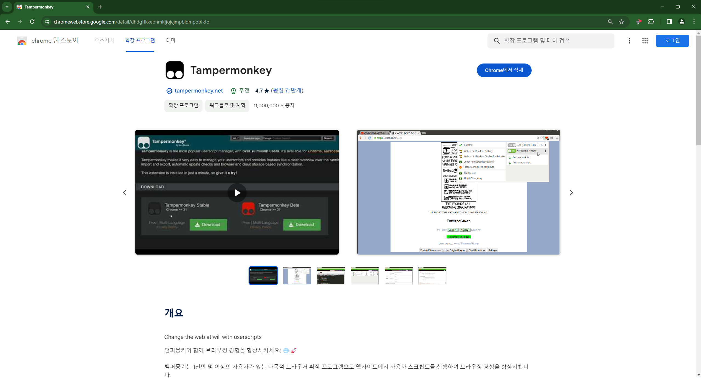
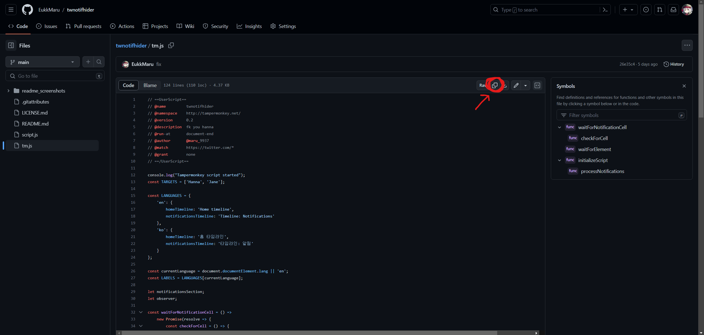
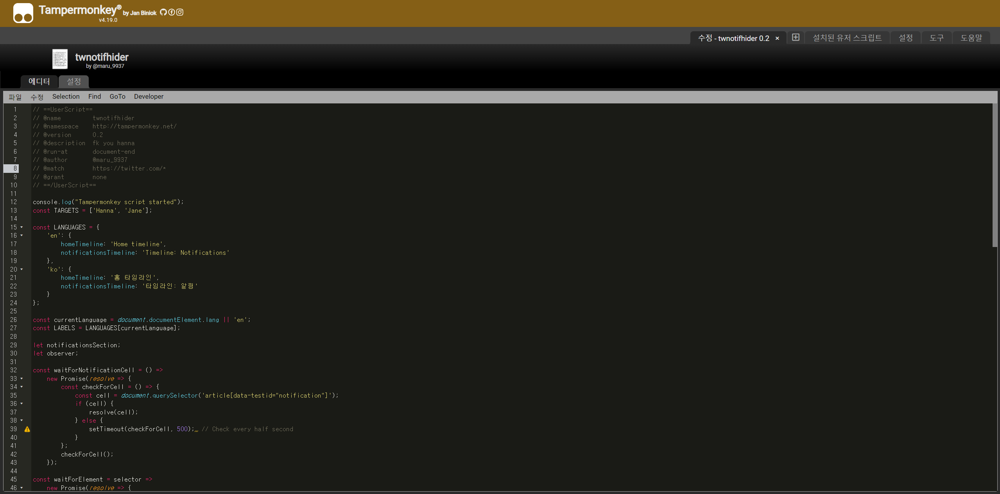
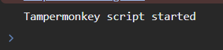

# twnotifhider

## For Hanna

**fk you hanna**  
**fk you hanna**  
  

## Usage

Simply paste the program code (`script.js`) into your browser's console (usually accessible via `F12` on most browsers). Note that the program will cease to run upon refreshing the page.

프로그램 코드 (`script.js`) 를 브라우저의 콘솔에 붙여 넣으세요 (대부분의 브라우저에서는 `F12`로 액세스 가능합니다). 페이지를 새로고침하면 프로그램이 실행되지 않습니다. 다시 실행하려면 콘솔에 다시 붙여 넣으십시오.

### Tampermonkey

If you wish to use this program more persistently, you can consider integrating it into a userscript manager like Tampermonkey. This will allow the program to run automatically without having to manually paste the code every time you visit a page.
For Tampermonkey integration, use `tm.js` instead of `script.js`.

이 프로그램을 지속적으로 사용하고 싶다면, 탬퍼몽키와 같은 유저스크립트 관리자에 통합하는 것을 고려할 수 있습니다. 이렇게 하면 페이지를 방문할 때마다 코드를 수동으로 붙여 넣지 않아도 프로그램이 자동으로 실행됩니다.
Tampermonkey 사용을 위해서는 `script.js` 대신 `tm.js`를 사용하십시오.

### Tampermonkey extension guide (Chrome)

#### Downloading TamperMonkey Extension

1. Navigate to the [TamperMonkey Chrome extension page](https://chromewebstore.google.com/detail/tampermonkey/dhdgffkkebhmkfjojejmpbldmpobfkfo).
2. Click on 'Add to Chrome' to install the extension.
 

1. [TamperMonkey Chrome 확장 프로그램 페이지](https://chromewebstore.google.com/detail/tampermonkey/dhdgffkkebhmkfjojejmpbldmpobfkfo)로 이동합니다. 
2. 'Chrome에 추가'를 클릭하여 확장 프로그램을 설치합니다.

#### Script Setup

After installation, you'll see the TamperMonkey icon in your browser's extension area (Puzzle icon in the top right). Click on it, and select 'Create a new script'

설치 후, 브라우저의 확장 프로그램 영역 (우상단의 퍼즐 모양 아이콘)에 TamperMonkey 아이콘이 표시됩니다. 탬퍼몽키 아이콘을 클릭하고 '새 스크립트 만들기'를 선택합니다.

You will see a default script template. Delete all of the default code and paste the code from [tm.js](https://github.com/EukkMaru/twnotifhider/blob/main/tm.js) into the editor.

기본 스크립트 템플릿이 있을겁니다. 이미 쓰여있는 기본 코드를 모두 지우고 [tm.js](https://github.com/EukkMaru/twnotifhider/blob/main/tm.js)의 코드를 붙여 넣으세요.

Then press `Ctrl/Cmd` + `S` to save the script. You can now close the editor.

`Ctrl/Cmd` + `S`를 눌러 스크립트를 저장합니다. 이제 에디터를 닫아도 됩니다.

Refresh the twitter page and you should see the script running.

트위터 페이지를 새로고침하면 스크립트가 실행되는 것을 볼 수 있습니다.

## Updates

This script does not support automatic updates. You will have to manually update the script by pasting the new code into the userscript manager (or browser console) whenever a new patch is released. Problems may occur if you use the deprecated version of the script.

이 스크립트는 자동 업데이트를 지원하지 않습니다. 새로운 패치가 출시될 때마다 새 코드를 유저스크립트 관리자 (또는 브라우저 콘솔)에 붙여 넣어야 스크립트를 수동으로 업데이트할 수 있습니다. 더 이상 지원되지 않는 버전의 스크립트를 사용하면 문제가 발생할 수 있습니다.

## Known Issues

1. Posts with multiple likes that don't display the name 'hanna' in the notification message (e.g. 'Maru and 58 more liked your post') cannot be filtered. 
   여러 사람이 마음을 누른 게시물에서 '한나'라는 이름이 알림 메시지에 표시되지 않는 경우 (예: 'Maru님 외 58명이 내 게시물을 마음에 들어 합니다') 필터링할 수 없습니다. 
In such cases, more profile pictures are displayed than usernames, so the profile picture of 'hanna' might be visible if it is within the appropriate range. 
   위와 같은 경우 사용자 이름보다 프로필 사진이 더 많이 표시되므로 경우에 따라 '한나'의 프로필 사진이 표시될 수 있습니다.

2. The script doesn't 'block' hanna but rather visually removes 'hanna' from your notification page. This means it's not a permanent solution, and others can still see Hanna's likes.   
   이 스크립트는 한나를 '차단'하는 게 아니라 알림 페이지에서 한나를 시각적으로 제거하기만 합니다. 이는 영구적인 해결책이 아니며 다른 사람들은 여전히 한나의 반응을 볼 수 있습니다. 

3. Detection is based on nicknames. So, if someone is named 'Hanna' or includes the word 'Hanna' in their nickname, even if they're not the spammer, their notifications will still be removed.   
   한나 감지는 닉네임을 기반으로 이루어집니다. 따라서 누군가가 'Hanna'라는 이름을 사용하거나 이름에 'Hanna'라는 단어를 포함하고 있더라도 그들의 알림이 제거됩니다. 

4. The script cannot remove the '1' badge when receiving new notifications. Reloading resets the script, which is counterintuitive. I am looking for solutions. Until then, you will have to refresh and re-run the script after receiving new notifications. Or, you can automate this process with Tampermonkey. 
   이 스크립트는 새로운 알림을 받을 때 알림에 뜨는 '1' 배지를 제거할 수 없습니다. 페이지를 새로고침하면 스크립트가 재설정되어 비직관적입니다. 가능한 경우 탬퍼몽키를 활용해 이 과정을 자동화할 수 있습니다. 직접 콘솔로 스크립트를 실행하는 경우에는 부득이하게 새로고침 후 스크립트를 다시 실행해야 합니다. 

5. So far the script only supports English and Korean environment. You can either add your language's aria-label attribute yourself in the LANGUAGES object or conact me to update the code for your language. 
    현재 이 스크립트는 한국어와 영어만 지원합니다. 다른 언어에서도 사용하기를 원하시면 LANGUAGES 오브젝트에 직접 본인 언어의 aria-label 속성을 추가하시거나, 저에게 연락하여 코드를 업데이트해달라고 요청하십시오.

6. ~~The script ceases to function after few dozen second has elapsed since refresh; refreshing the page (`F5`) temporarily fixes it. A fix for this issue has been implemented but still requires testing. If you encounter this issue, please contact me.~~ 
   ~~페이지를 새로고침한 후 몇십 초가 지나면 스크립트가 작동을 멈춥니다. 페이지를 새로고침하면 임시로 해결됩니다. 이 문제를 해결하기 위한 수정이 구현되었지만 아직 테스트가 필요합니다. 이 문제가 발생하면 저에게 연락해주세요.~~    

## Warning

Always ensure that you understand and trust any code that you run in your browser console or install as a userscript. Running malicious or untrusted code can compromise the security of your data and personal information.

브라우저 콘솔에서 실행하거나 사용자 스크립트로 설치하는 모든 코드를 이해하고 신뢰하는지 항상 확인하세요. 악의적인 또는 신뢰할 수 없는 코드를 실행하면 데이터와 개인 정보의 보안이 침해될 수 있습니다.

## Changelog
[Changelog](CHANGELOG.md)

## License

[MIT License](LICENSE.md)

## Credits

Developed by EukkMaru

개발자 윾마루

## Contact

If you have any questions or feedback, feel free to contact @EukkMaru on Discord

질문이나 피드백이 있으시면 디스코드 @EukkMaru로 연락주세요
